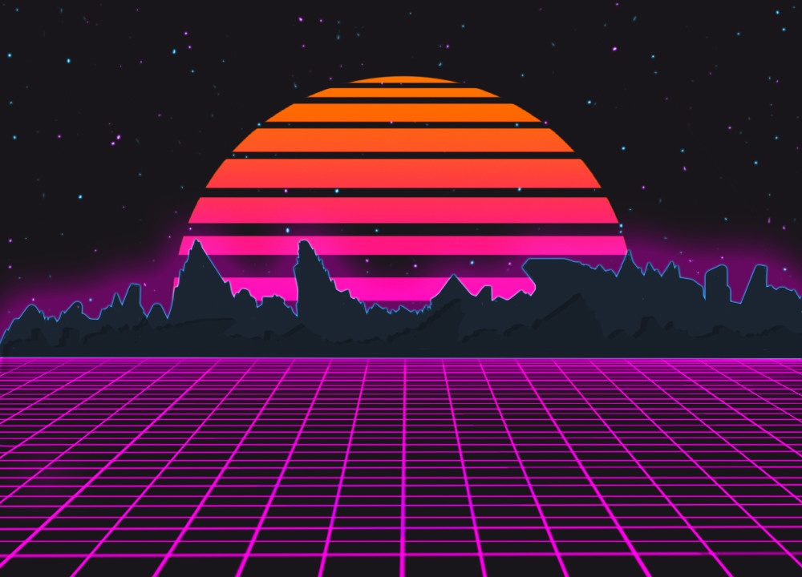

# Vaporwave Music Mixer

This is the Git Repo for our vaporwave themed music mixer project. The vaporwave theme is focused on the 80's style of neon lights and bright colors and also has a heavy muscle car view. This theme can be seen in many different racing video games such as "Far Cry:Blood Dragon" and "OutDrive". Our music samples will be split into four different categories; bass, percussion, high synth, and low synth.

### Getting Started
This is a basic HTML / CSS / JavaScript build.
To view the page, clone this to the location of your choice, and open the ".html" file.
You can also view the source code by opening it in any code editing program of  your choice, or clicking inspect in a chrome tab.

## Authors
1. Greg Avery - Front End Dev
2. Nathan Jennec - Designer
